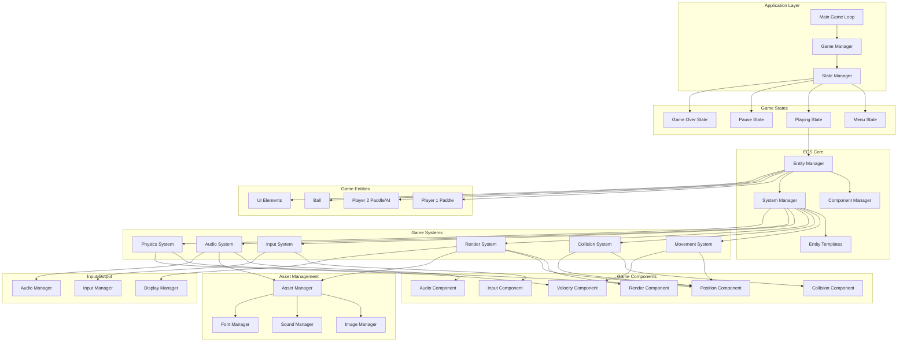
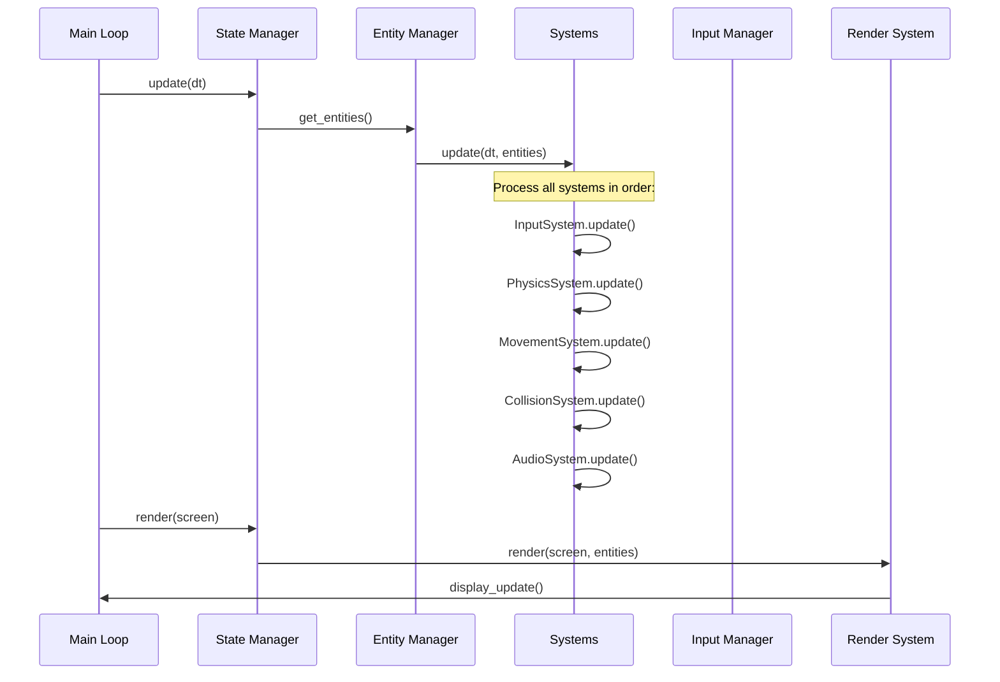
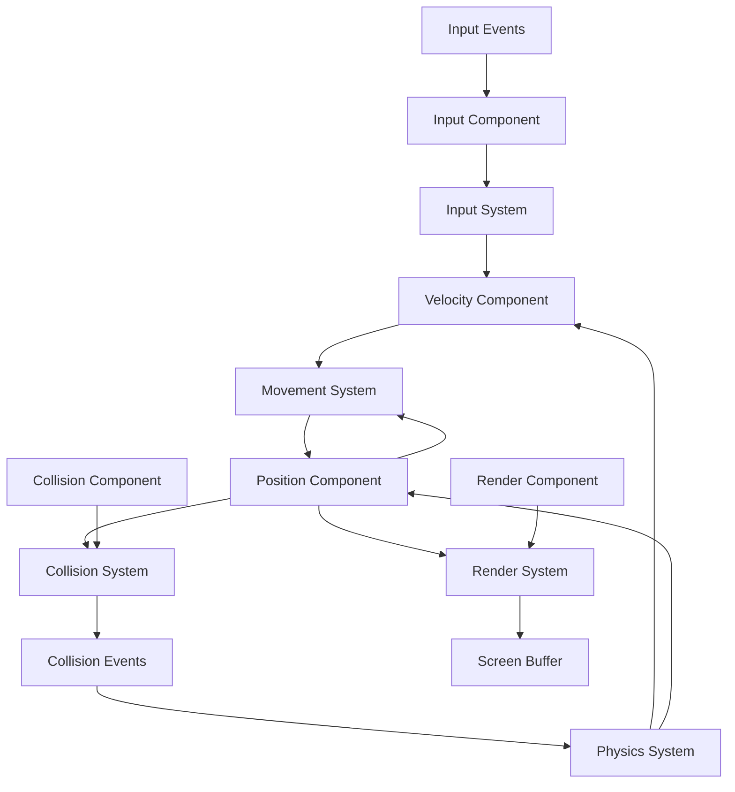
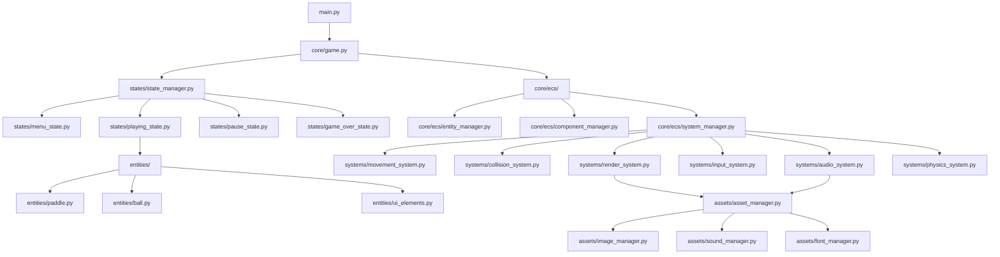

# Ping-Pong Game - System Architecture

## 1. Architecture Overview

### Architectural Style
The ping-pong game follows a **Component-Based Architecture** with **Entity-Component-System (ECS)** pattern, ensuring clean separation of concerns, high performance, and excellent maintainability.

### Core Design Principles
1. **Single Responsibility**: Each class/module has one clear purpose
2. **Dependency Injection**: Loose coupling through interface-based design
3. **Performance First**: Optimized for 60fps real-time gameplay
4. **Extensibility**: Easy addition of new features without core changes
5. **Testability**: All components are independently testable

## 2. System Architecture Diagram



## 3. Component Architecture Details

### 3.1 Entity-Component-System (ECS) Implementation

#### Entity Manager
```python
class EntityManager:
    """Manages entity lifecycle and component assignments"""
    
    def create_entity(self) -> EntityID
    def destroy_entity(self, entity_id: EntityID)
    def add_component(self, entity_id: EntityID, component: Component)
    def remove_component(self, entity_id: EntityID, component_type: Type)
    def get_component(self, entity_id: EntityID, component_type: Type) -> Component
    def has_component(self, entity_id: EntityID, component_type: Type) -> bool
```

#### Core Components
```python
@dataclass
class PositionComponent:
    x: float
    y: float

@dataclass
class VelocityComponent:
    dx: float
    dy: float

@dataclass
class RenderComponent:
    sprite: pygame.Surface
    layer: int = 0
    visible: bool = True

@dataclass
class CollisionComponent:
    rect: pygame.Rect
    collision_type: CollisionType
    solid: bool = True

@dataclass
class InputComponent:
    key_bindings: Dict[int, str]
    enabled: bool = True
```

#### Game Systems
```python
class MovementSystem(System):
    """Updates entity positions based on velocity"""
    
    def update(self, dt: float, entities: List[EntityID]):
        for entity in entities:
            pos = self.get_component(entity, PositionComponent)
            vel = self.get_component(entity, VelocityComponent)
            pos.x += vel.dx * dt
            pos.y += vel.dy * dt

class CollisionSystem(System):
    """Handles collision detection and response"""
    
    def update(self, dt: float, entities: List[EntityID]):
        colliders = self.get_entities_with_components([CollisionComponent, PositionComponent])
        for a, b in itertools.combinations(colliders, 2):
            if self.check_collision(a, b):
                self.handle_collision(a, b)
```

### 3.2 Game State Management

#### State Machine Architecture
```python
class GameState(ABC):
    """Base class for all game states"""
    
    @abstractmethod
    def enter(self, previous_state: 'GameState') -> None
    @abstractmethod
    def exit(self, next_state: 'GameState') -> None
    @abstractmethod
    def update(self, dt: float) -> None
    @abstractmethod
    def render(self, screen: pygame.Surface) -> None
    @abstractmethod
    def handle_event(self, event: pygame.Event) -> None

class StateManager:
    """Manages game state transitions"""
    
    def __init__(self):
        self.states: Dict[str, GameState] = {}
        self.current_state: Optional[GameState] = None
        self.state_stack: List[GameState] = []
    
    def change_state(self, state_name: str) -> None
    def push_state(self, state_name: str) -> None
    def pop_state(self) -> None
```

#### Specific Game States
```python
class MenuState(GameState):
    """Main menu with game options"""
    
class PlayingState(GameState):
    """Active gameplay state with ECS systems"""
    
class PausedState(GameState):
    """Paused game state with overlay"""
    
class GameOverState(GameState):
    """End game state with results"""
```

### 3.3 Performance Optimization Architecture

#### Object Pooling
```python
class ObjectPool(Generic[T]):
    """Generic object pool for performance optimization"""
    
    def __init__(self, factory: Callable[[], T], initial_size: int = 10):
        self.factory = factory
        self.available: List[T] = []
        self.in_use: Set[T] = set()
        self._initialize_pool(initial_size)
    
    def acquire(self) -> T
    def release(self, obj: T) -> None
    def expand_pool(self, size: int) -> None
```

#### Rendering Optimization
```python
class RenderSystem(System):
    """Optimized rendering with dirty rectangles and layering"""
    
    def __init__(self):
        self.dirty_regions: List[pygame.Rect] = []
        self.render_layers: Dict[int, List[EntityID]] = defaultdict(list)
        self.background_cache: pygame.Surface = None
    
    def update(self, dt: float, entities: List[EntityID]):
        self._update_dirty_regions()
        self._sort_by_layers()
        self._render_layers()
        self._update_display()
```

## 4. Data Flow Architecture

### Game Loop Data Flow


### Component Data Dependencies


## 5. Module Dependencies

### Dependency Graph


## 6. Interface Definitions

### Core Interfaces
```python
class System(ABC):
    """Base interface for all ECS systems"""
    
    @abstractmethod
    def update(self, dt: float, entities: List[EntityID]) -> None
    
    @abstractmethod
    def get_required_components(self) -> List[Type[Component]]

class Component(ABC):
    """Base interface for all ECS components"""
    pass

class Manager(ABC):
    """Base interface for singleton managers"""
    
    @abstractmethod
    def initialize(self) -> None
    
    @abstractmethod
    def shutdown(self) -> None
```

### Game-Specific Interfaces
```python
class Controllable(Protocol):
    """Interface for entities that can be controlled by input"""
    
    def handle_input(self, input_state: InputState) -> None

class Collidable(Protocol):
    """Interface for entities that participate in collision detection"""
    
    def get_collision_bounds(self) -> pygame.Rect
    def on_collision(self, other: 'Collidable', collision_info: CollisionInfo) -> None

class Renderable(Protocol):
    """Interface for entities that can be rendered"""
    
    def get_render_data(self) -> RenderData
    def get_render_layer(self) -> int
```

## 7. Configuration Architecture

### Configuration Management
```python
class GameConfig:
    """Centralized configuration management"""
    
    # Display settings
    SCREEN_WIDTH: int = 800
    SCREEN_HEIGHT: int = 600
    TARGET_FPS: int = 60
    FULLSCREEN: bool = False
    
    # Game settings
    BALL_SPEED: float = 200.0
    PADDLE_SPEED: float = 300.0
    WINNING_SCORE: int = 10
    
    # Physics settings
    BALL_BOUNCE_FACTOR: float = 1.0
    PADDLE_BOUNCE_FACTOR: float = 1.1
    
    # Audio settings
    MASTER_VOLUME: float = 0.8
    SFX_VOLUME: float = 1.0
    MUSIC_VOLUME: float = 0.6
    
    @classmethod
    def load_from_file(cls, config_path: str) -> None
    
    @classmethod
    def save_to_file(cls, config_path: str) -> None
```

## 8. Error Handling Architecture

### Exception Hierarchy
```python
class PingPongGameException(Exception):
    """Base exception for all game-related errors"""
    pass

class AssetLoadError(PingPongGameException):
    """Raised when assets fail to load"""
    pass

class SystemError(PingPongGameException):
    """Raised when ECS systems encounter errors"""
    pass

class StateTransitionError(PingPongGameException):
    """Raised when state transitions fail"""
    pass
```

### Error Recovery Strategies
```python
class ErrorHandler:
    """Centralized error handling and recovery"""
    
    def handle_asset_error(self, error: AssetLoadError) -> None:
        # Fallback to default assets
        
    def handle_system_error(self, error: SystemError) -> None:
        # Disable problematic system, continue with others
        
    def handle_critical_error(self, error: Exception) -> None:
        # Save game state, graceful shutdown
```

## 9. Testing Architecture

### Test Strategy
```python
class ComponentTest(unittest.TestCase):
    """Tests for ECS components"""
    
class SystemTest(unittest.TestCase):
    """Tests for ECS systems with mock entities"""
    
class IntegrationTest(unittest.TestCase):
    """Tests for system interactions"""
    
class GameplayTest(unittest.TestCase):
    """End-to-end gameplay scenario tests"""
```

### Mock Framework
```python
class MockEntityManager:
    """Mock entity manager for testing systems in isolation"""
    
class MockAssetManager:
    """Mock asset manager for testing without actual assets"""
    
class MockInputManager:
    """Mock input manager for automated gameplay testing"""
```

---

**Document Version**: 1.0  
**Last Updated**: [Current Date]  
**Approved By**: Technical Architecture Team 